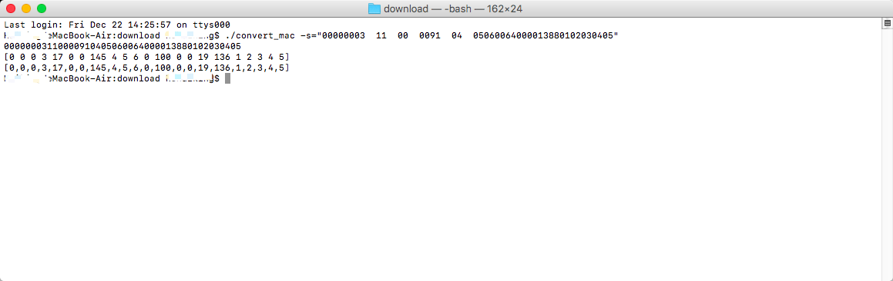
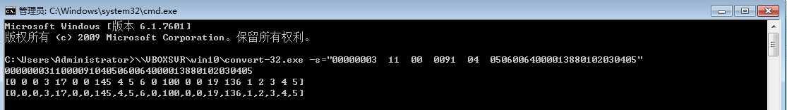

convert
============================
### 简介
此工具用于将16进制字符串转换成10进制byte数组

### 安装

  ```
  go  get  -u  github.com/Bestfeel/convert
  ```

### 使用

```
                                                   _
                                          ________| |
                                         |__________|
                                          __________
                                         |  ________|   万物互联
                                         | |   _____
                                         | |  |___  |   机智云
                                         | |______| |
                                         |__________|   Gizwits
                                          机智云只为硬件而生的云服务


-s=“string”

示例:

convert -s="00000003  15  00  0091  04  0000000000000000000000000000000000"

输出:

0000000315000091040000000000000000000000000000000000
[0 0 0 3 21 0 0 145 4 0 0 0 0 0 0 0 0 0 0 0 0 0 0 0 0 0]
[0,0,0,3,21,0,0,145,4,0,0,0,0,0,0,0,0,0,0,0,0,0,0,0,0,0]


```

### 各系统使用教程
#### MAC OS
下载文件：
* [convert_mac](download/convert_mac)

使用终端打开文件所在目录：
输入：./convert_mac -s="需要转换的16进制字符串"，回车执行



#### Windows
下载文件：
* 32位[convert_win32](download/convert_win32.exe)
* 64位[convert_win64](download/convert_win64.exe)

使用命令提示符打开文件所在目录，或将文件拖进命令提示符
输入： convert-32.exe -s="需要转换的16进制字符串"，回车执行


